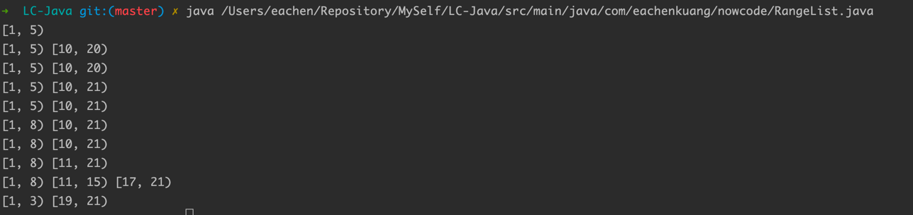

How to user the RangeList class?

Just import RangeList and then you can user function like `add`, `remove`, `print`。

```java
    RangeList rangeList = new RangeList();
    rangeList.add(new int[]{1,5});
    rangeList.print();
    rangeList.add(new int[]{10,20});
    rangeList.print();
    rangeList.add(new int[]{20,20});
    rangeList.print();
    rangeList.add(new int[]{20,21});
    rangeList.print();
    rangeList.add(new int[]{2,4});
    rangeList.print();
    rangeList.add(new int[]{3,8});
    rangeList.print();
    rangeList.remove(new int[]{10,10});
    rangeList.print();
    rangeList.remove(new int[]{10,11});
    rangeList.print();
    rangeList.remove(new int[]{15,17});
    rangeList.print();
    rangeList.remove(new int[]{3,19});
    rangeList.print();
```

How to run the file?
ensure you have java environment in your pc and then run
```shell
java <your-path-of-RangeList file>
```

The result in my pc is below
